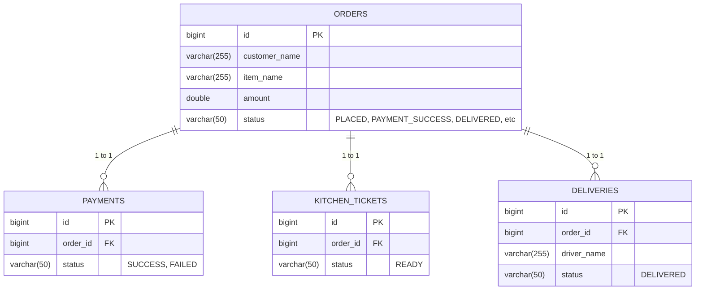

# Database Design Document

## 1. ER Diagram

## 2. Table Definitions

### 2.1 Table: `orders` (Order Service)
| Column Name   | Data Type     | Constraints           | Description                          |
|---------------|---------------|-----------------------|--------------------------------------|
| `id`          | BIGINT        | PRIMARY KEY, AUTO_INC | Unique identifier for the order.     |
| `customer_name`| VARCHAR(255) | NOT NULL              | Name of the customer.                |
| `item_name`   | VARCHAR(255)  | NOT NULL              | Food item ordered.                   |
| `amount`      | DOUBLE        | NOT NULL              | Total price of the order.            |
| `status`      | VARCHAR(50)   | NOT NULL              | Current lifecycle status.            |

### 2.2 Table: `payment` (Payment Service)
| Column Name   | Data Type     | Constraints           | Description                          |
|---------------|---------------|-----------------------|--------------------------------------|
| `id`          | BIGINT        | PRIMARY KEY, AUTO_INC | Unique identifier for the payment.   |
| `order_id`    | BIGINT        | NOT NULL              | Associated order ID.                 |
| `status`      | VARCHAR(50)   | NOT NULL              | Result of the payment (e.g. SUCCESS) |

### 2.3 Table: `kitchen_ticket` (Kitchen Service)
| Column Name   | Data Type     | Constraints           | Description                          |
|---------------|---------------|-----------------------|--------------------------------------|
| `id`          | BIGINT        | PRIMARY KEY, AUTO_INC | Unique identifier for the ticket.    |
| `order_id`    | BIGINT        | NOT NULL              | Associated order ID.                 |
| `status`      | VARCHAR(50)   | NOT NULL              | Kitchen preparation status.          |

### 2.4 Table: `delivery` (Delivery Service)
| Column Name   | Data Type     | Constraints           | Description                          |
|---------------|---------------|-----------------------|--------------------------------------|
| `id`          | BIGINT        | PRIMARY KEY, AUTO_INC | Unique identifier for the delivery.  |
| `order_id`    | BIGINT        | NOT NULL              | Associated order ID.                 |
| `driver_name` | VARCHAR(255)  | NOT NULL              | Name of the mock driver assigned.    |
| `status`      | VARCHAR(50)   | NOT NULL              | Delivery status.                     |

*(Note: Camunda also generates its own internal `act_` tables in the database for workflow tracking, which are managed automatically by the Camunda Spring Boot Starter).*
