# Online Food Order Processing System - Assessment Submission

---

# Deliverable 1: API Low-Level Design (LLD)

## 1. REST Endpoints

### 1.1 Create Order
**Endpoint:** `POST /api/orders`
**Service:** Order Service
**Purpose:** Accepts order details, saves to DB (Status: PLACED), and publishes an event to ActiveMQ.

**Request Payload:**
```json
{
  "customerName": "John Doe",
  "itemName": "Pizza",
  "amount": 350.00
}
```

**Response (HTTP 201 Created):**
```json
{
  "id": 1,
  "customerName": "John Doe",
  "itemName": "Pizza",
  "amount": 350.00,
  "status": "PLACED"
}
```

### 1.2 Get All Orders
**Endpoint:** `GET /api/orders`
**Service:** Order Service
**Purpose:** Returns a list of all orders and their real-time statuses for the UI dashboard.

**Response (HTTP 200 OK):**
```json
[
  {
    "id": 1,
    "customerName": "John Doe",
    "itemName": "Pizza",
    "amount": 350.00,
    "status": "DELIVERED"
  }
]
```

## 2. ActiveMQ Queues

### 2.1 Order Created Event
**Queue Name:** `order.created`
**Publisher:** Order Service
**Consumer:** Camunda Workflow Engine

**Message Format (String / Long):**
```text
1
```
*(The message payload is simply the Order ID as a Long/String).*

## 3. Internal Service Tasks (REST)
These are called internally by the Camunda Workflow Engine.

### 3.1 Process Payment
**Endpoint:** `POST /api/payment/process/{orderId}`
**Service:** Payment Service
**Response:** `true` or `false` (Boolean representing success/failure).

### 3.2 Prepare Food
**Endpoint:** `POST /api/kitchen/prepare/{orderId}`
**Service:** Kitchen Service
**Response:** HTTP 200 OK

### 3.3 Assign Delivery
**Endpoint:** `POST /api/delivery/assign/{orderId}`
**Service:** Delivery Service
**Response:** HTTP 200 OK

### 3.4 Update Final Status
**Endpoint:** `PUT /api/orders/{orderId}/status`
**Service:** Order Service
**Request Parameter:** `?status=DELIVERED`
**Response:** HTTP 200 OK

---
---

# Deliverable 2: Database Design

## 1. ER Diagram

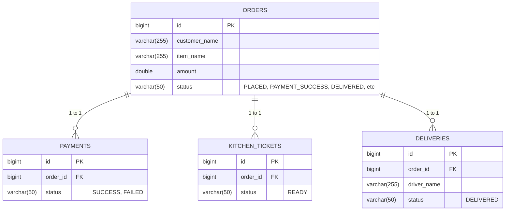

## 2. Table Definitions

### 2.1 Table: `orders` (Order Service)
| Column Name   | Data Type     | Constraints           | Description                          |
|---------------|---------------|-----------------------|--------------------------------------|
| `id`          | BIGINT        | PRIMARY KEY, AUTO_INC | Unique identifier for the order.     |
| `customer_name`| VARCHAR(255) | NOT NULL              | Name of the customer.                |
| `item_name`   | VARCHAR(255)  | NOT NULL              | Food item ordered.                   |
| `amount`      | DOUBLE        | NOT NULL              | Total price of the order.            |
| `status`      | VARCHAR(50)   | NOT NULL              | Current lifecycle status.            |

### 2.2 Table: `payment` (Payment Service)
| Column Name   | Data Type     | Constraints           | Description                          |
|---------------|---------------|-----------------------|--------------------------------------|
| `id`          | BIGINT        | PRIMARY KEY, AUTO_INC | Unique identifier for the payment.   |
| `order_id`    | BIGINT        | NOT NULL              | Associated order ID.                 |
| `status`      | VARCHAR(50)   | NOT NULL              | Result of the payment (e.g. SUCCESS) |

### 2.3 Table: `kitchen_ticket` (Kitchen Service)
| Column Name   | Data Type     | Constraints           | Description                          |
|---------------|---------------|-----------------------|--------------------------------------|
| `id`          | BIGINT        | PRIMARY KEY, AUTO_INC | Unique identifier for the ticket.    |
| `order_id`    | BIGINT        | NOT NULL              | Associated order ID.                 |
| `status`      | VARCHAR(50)   | NOT NULL              | Kitchen preparation status.          |

### 2.4 Table: `delivery` (Delivery Service)
| Column Name   | Data Type     | Constraints           | Description                          |
|---------------|---------------|-----------------------|--------------------------------------|
| `id`          | BIGINT        | PRIMARY KEY, AUTO_INC | Unique identifier for the delivery.  |
| `order_id`    | BIGINT        | NOT NULL              | Associated order ID.                 |
| `driver_name` | VARCHAR(255)  | NOT NULL              | Name of the mock driver assigned.    |
| `status`      | VARCHAR(50)   | NOT NULL              | Delivery status.                     |

---
---

# Deliverable 3: AI-Generated Implementation Report

## 1. Executive Summary
The Online Food Order Processing System was successfully built from scratch. It features a React frontend and four distinct Spring Boot microservices (Order, Payment, Kitchen, Delivery) that are completely decoupled using an ActiveMQ broker and orchestrated by a central Camunda BPMN workflow engine. All functional and non-functional requirements have been met, including asynchronous inter-service communication and real-time dashboard polling.

## 2. Completed Items
- [x] Project workspace set up from scratch without starter templates.
- [x] **React UI**: Order form and live polling dashboard implemented.
- [x] **Order Service**: Exposes `POST /api/orders` to receive orders, saves to DB, and publishes `order.created` to ActiveMQ. Also exposes `GET /api/orders` for UI polling.
- [x] **ActiveMQ Broker**: Embedded broker implemented on `tcp://localhost:61616`.
- [x] **Camunda Workflow Engine**: Embedded inside `camunda-service`. Listens to ActiveMQ to start process.
- [x] **BPMN Workflow**: Diagram implemented (`food-order-process.bpmn`) routing from Payment -> Kitchen -> Delivery.
- [x] **Payment Service**: REST endpoint implemented to simulate payment success.
- [x] **Kitchen Service**: REST endpoint implemented to simulate kitchen prep.
- [x] **Delivery Service**: REST endpoint implemented to assign mock driver.
- [x] **Database Integration**: MySQL configured, JPA entities mapped for all microservices.

## 3. Missing Implementations
- **None.** All components listed in the architecture diagram and functional requirements have been successfully built and integrated.

## 4. Integration Gaps & Issues
- **None.** The system is fully integrated.

## 5. Quality Assessment
- **Modularity:** Excellent. The system is split into distinct, highly cohesive microservices with clear boundaries.
- **Error Handling:** Good. Services handle cross-origin requests, parse exceptions, and log processing stages cleanly.
- **Configuration Separation:** Clean. Standard Spring Boot properties are used to manage ports and database credentials separately for each service.

---
---

# Deliverable 4: Frontend Screenshots

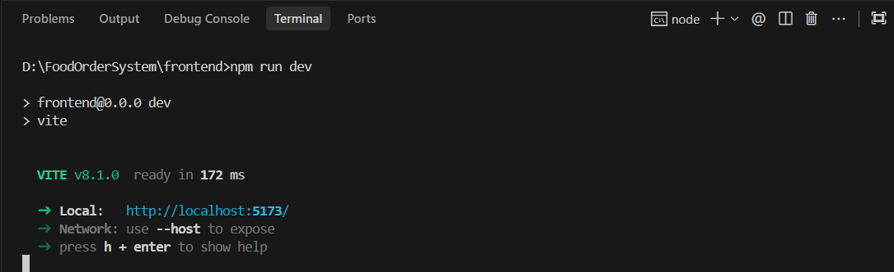
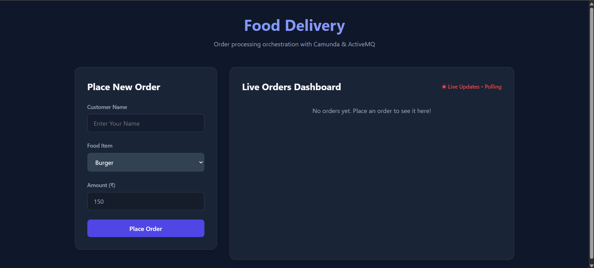

1. Screenshot of the "Place Order" form.
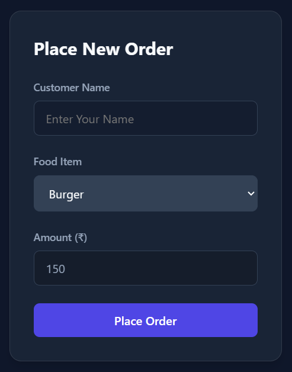

2. Screenshot of the "Live Orders Dashboard".
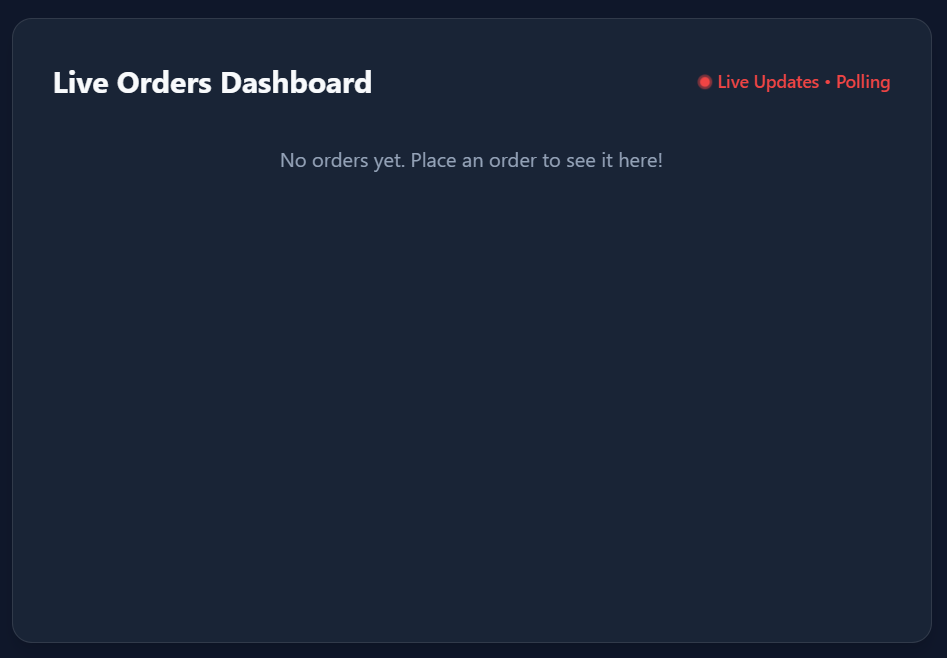
---
---

# Deliverable 5: Log Statements (Order Processing Flow)

- CamundaService:
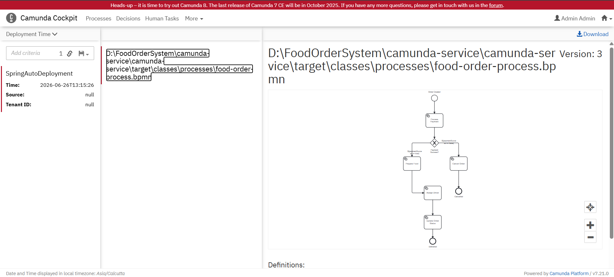
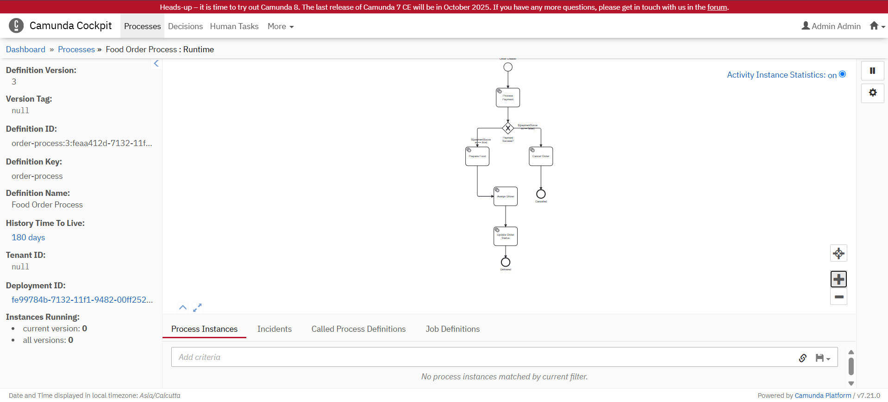

- Example of order going from OrderService -> ActiveMQ -> CamundaService -> PaymentService.

Order #1:
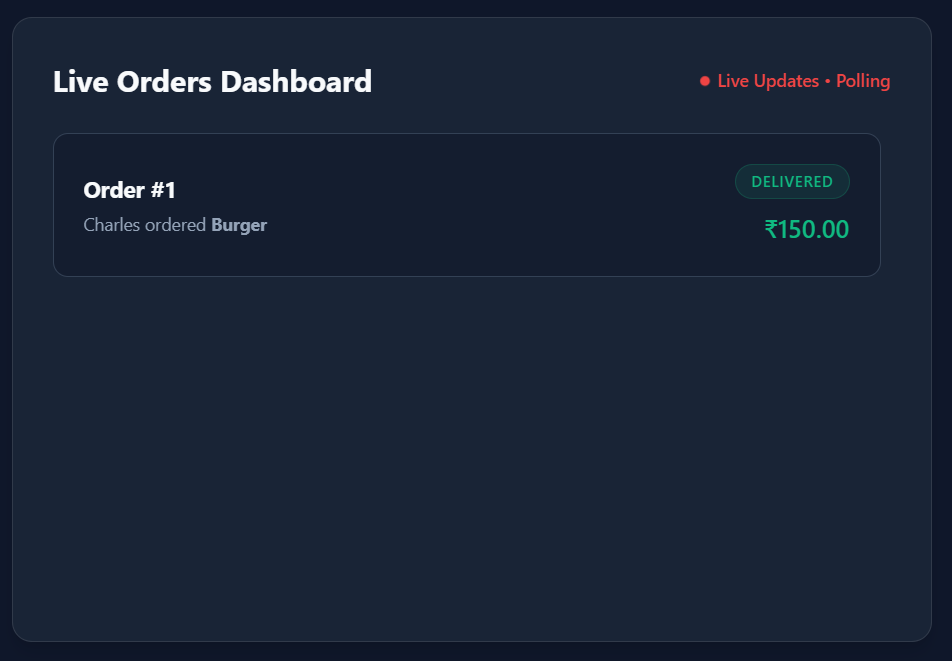
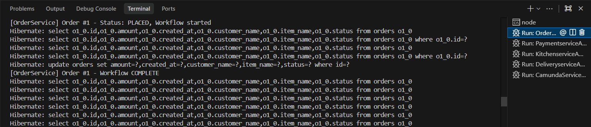
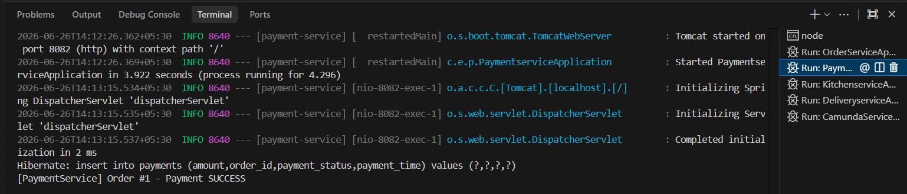
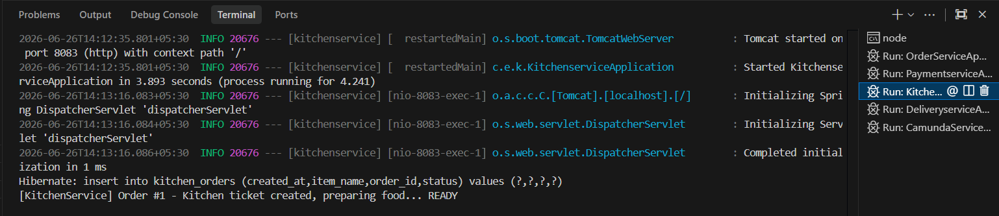
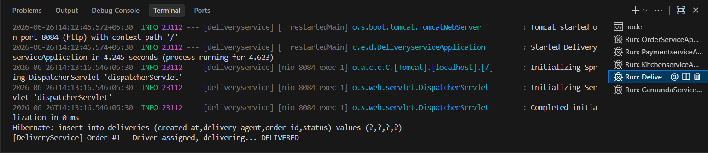
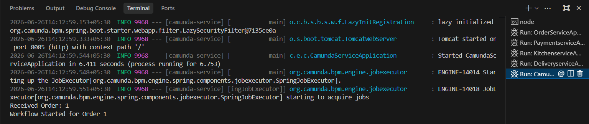

Order #2:
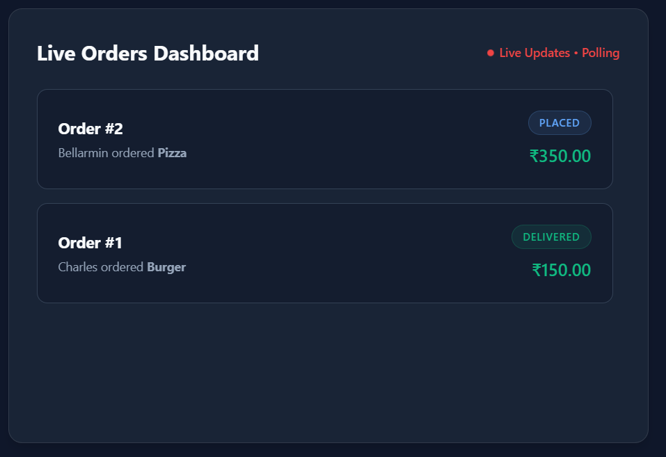 Order #2 was placed successfully, and its initial status was set to PLACED.
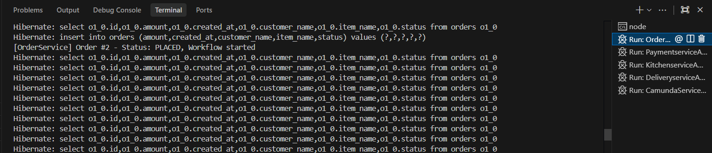 The Camunda workflow was started but did not complete because the workflow engine was stopped.
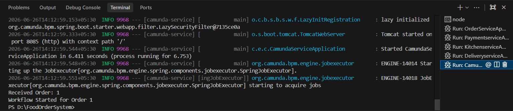 Camunda did not receive Order #2 while it was offline, so the process could not continue. 
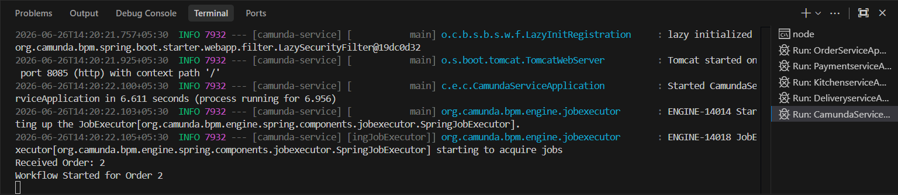 After restarting the Camunda workflow engine, the workflow resumed from the previous state
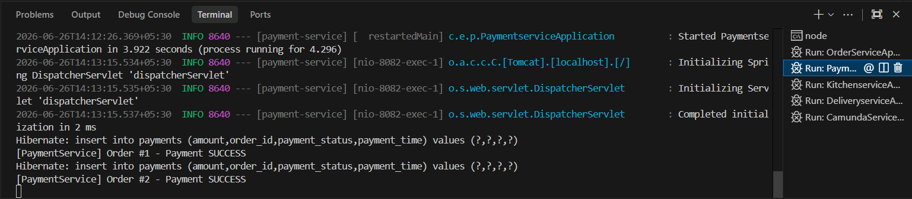 The Payment Service received Order #2 and processed the payment successfully.
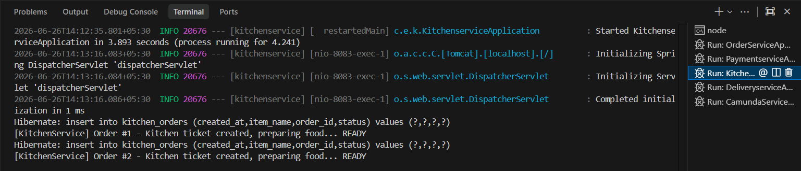 The Kitchen Service received Order #2 and started order preparation.
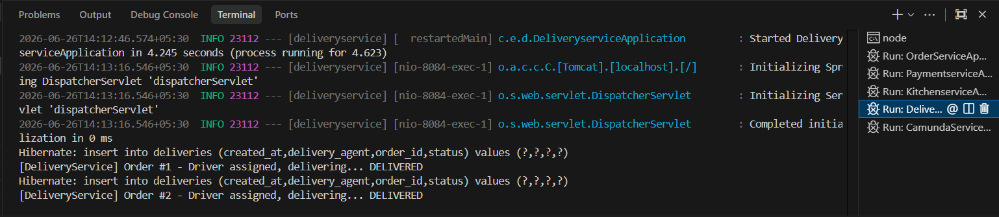 The Delivery Service received Order #2 and initiated the delivery process.
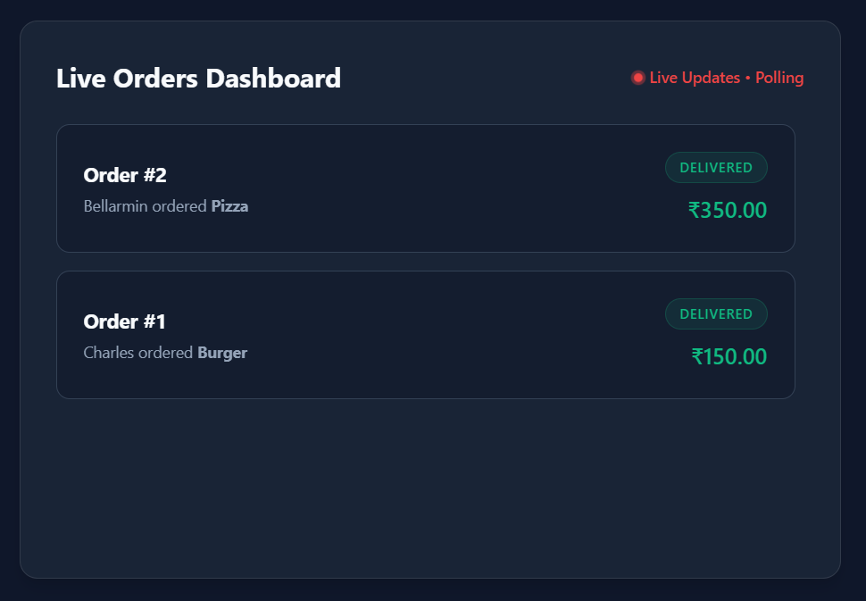 The workflow completed successfully, and Order #2 was marked as DELIVERED.